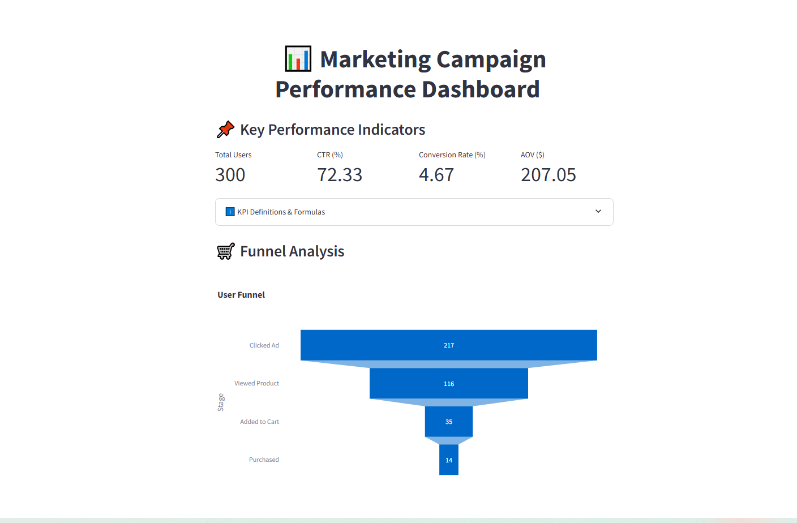
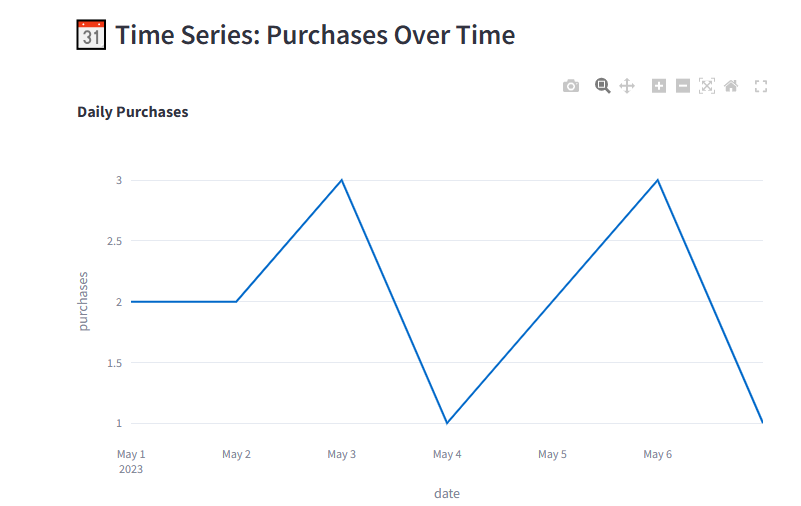
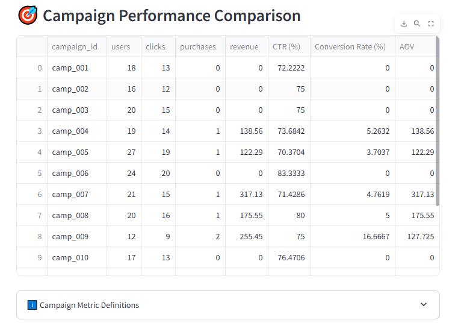
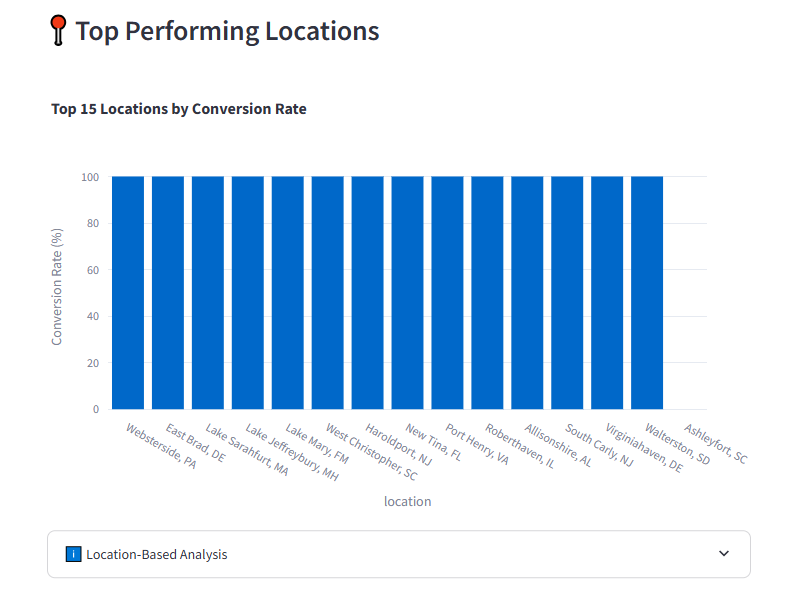

# 📊 Marketing Campaign Performance Dashboard

This Streamlit-based interactive dashboard helps marketers and analysts monitor, compare, and visualize performance across marketing campaigns using metrics like CTR, conversion rate, users, and clicks.

---

## 🚀 Features

- 📈 Campaign comparison with **lollipop charts** (CTR, Conversion Rate, Users, Clicks)
- 📊 Funnel analysis of user journey (Ad Click → View → Cart → Purchase)
- 🗓 Time series trends of daily purchases
- 🌎 Top-performing locations by conversion rate
- 📋 Interactive sidebar filters (campaign, device type, location)
- ℹ️ Dropdown with definitions & formulas of all important KPIs

---

## 🧪 Tech Stack

- **Python**
- **Streamlit**
- **Plotly Express & Graph Objects**
- **Pandas**
- **Faker (for synthetic data, optional)**

---

## 📂 File Structure
```
├── app.py
├── ecommerce_campaign_data.csv
├── README.md
```
1. Clone the repo or download the files:

```
git clone https://github.com/yourusername/marketing-dashboard.git
cd marketing-dashboard
```
2. Install required packages:
```
pip install streamlit pandas plotly
```
Run the app:
```
streamlit run app.py
```

## 📘 KPI Definitions (in app)
Each metric in the app includes an expandable section with:

- CTR (%) = (Ad Clicks ÷ Users) × 100

- Conversion Rate (%) = (Purchases ÷ Users) × 100

- AOV ($) = (Revenue ÷ Purchases)
- ...and more

## 📷 Preview







## 💡 Use Cases
A/B testing campaign performance

Funnel optimization analysis

Geo-targeted campaign planning


